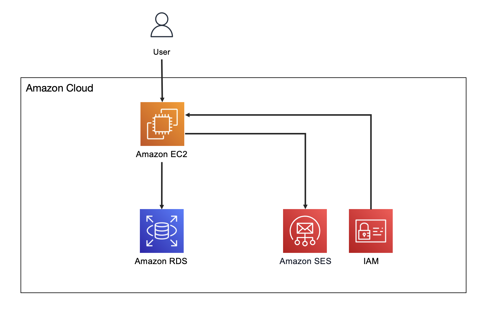

# Listmonk based EDM solution

Listmonk based EDM solution can be used to send emails. The solution uses Amazon Simple Email Service (Amazon SES) as an email sending platform and integrates a simple and clear operation interface. Users do not need to know about functions of Amazon Web Services. All deployments and installations can be completed with one click, and they can enjoy 62,000 free emails per month on Amazon SES. The solution can easily manage mailing lists, subscribers, email templates, campaigns, and features statistics and multilingual support to help users achieve business success.

 

***

This package depends on and may incorporate or retrieve a number of third-party
software packages (such as open source packages) at install-time or build-time
or run-time ("External Dependencies"). The External Dependencies are subject to
license terms that you must accept in order to use this package. If you do not
accept all of the applicable license terms, you should not use this package. We
recommend that you consult your company’s open source approval policy before
proceeding.

Provided below is a list of External Dependencies and the applicable license
identification as indicated by the documentation associated with the External
Dependencies as of Amazon's most recent review.

THIS INFORMATION IS PROVIDED FOR CONVENIENCE ONLY. AMAZON DOES NOT PROMISE THAT
THE LIST OR THE APPLICABLE TERMS AND CONDITIONS ARE COMPLETE, ACCURATE, OR
UP-TO-DATE, AND AMAZON WILL HAVE NO LIABILITY FOR ANY INACCURACIES. YOU SHOULD
CONSULT THE DOWNLOAD SITES FOR THE EXTERNAL DEPENDENCIES FOR THE MOST COMPLETE
AND UP-TO-DATE LICENSING INFORMATION.

YOUR USE OF THE EXTERNAL DEPENDENCIES IS AT YOUR SOLE RISK. IN NO EVENT WILL
AMAZON BE LIABLE FOR ANY DAMAGES, INCLUDING WITHOUT LIMITATION ANY DIRECT,
INDIRECT, CONSEQUENTIAL, SPECIAL, INCIDENTAL, OR PUNITIVE DAMAGES (INCLUDING
FOR ANY LOSS OF GOODWILL, BUSINESS INTERRUPTION, LOST PROFITS OR DATA, OR
COMPUTER FAILURE OR MALFUNCTION) ARISING FROM OR RELATING TO THE EXTERNAL
DEPENDENCIES, HOWEVER CAUSED AND REGARDLESS OF THE THEORY OF LIABILITY, EVEN
IF AMAZON HAS BEEN ADVISED OF THE POSSIBILITY OF SUCH DAMAGES. THESE LIMITATIONS
AND DISCLAIMERS APPLY EXCEPT TO THE EXTENT PROHIBITED BY APPLICABLE LAW.

Listmonk (https://listmonk.app) - Affero General Public License 3.0

***

## Prerequisites

To build and deploy this stack, please have the following tools installed. 

- AWS account

## Configuration

This stack use cloudformation file to provide configuration values. 

You can customize your parameters via cloudfromation console

## Deployment
You can use the cloudformation [template](https://github.com/aws-samples/listmonk-based-edm-solution/blob/main/listmonk-based-edm-solution.yaml)

## Clean up

Go to your cloudfromation console to delete the stack. 

### [Listmonk](https://github.com/knadh/listmonk)  
Source: https://github.com/knadh/listmonk

License: https://github.com/knadh/listmonk/blob/master/LICENSE

## License

This library is licensed under the MIT-0 License. See the [LICENSE](LICENSE) file.